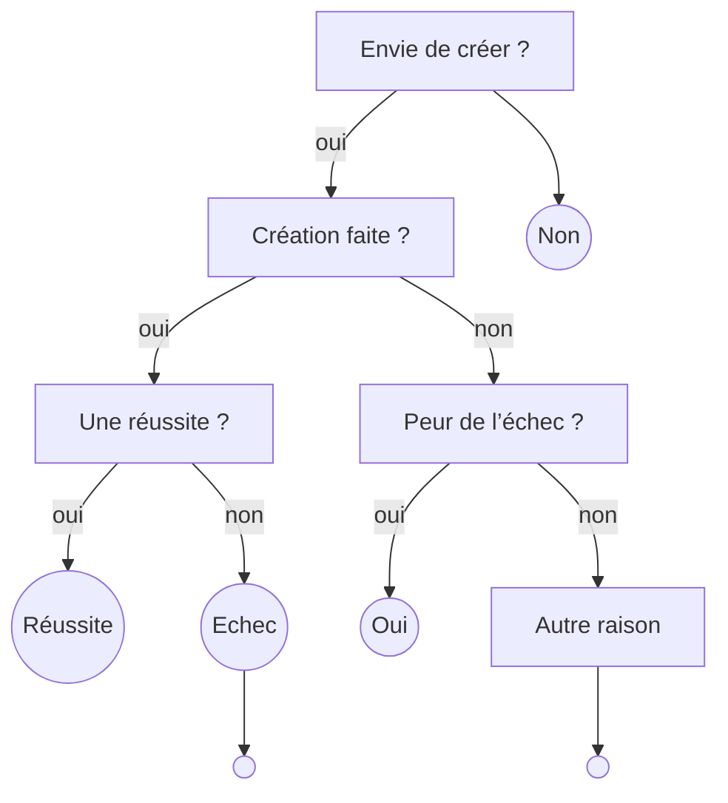

# Survey flow

```mermaid
flowchart TD
    Q1[Envie de créer ?]
    Q2[Création faite ?]
    Q3[Une réussite ?]
    Q4((Echec))
    Q5[Peur de l’échec ?]
    Q6[Autre raison]
    S1((Non))
    S2((Réussite))
    S4((Oui))
    S3(( ))
    S5(( ))

    Q1 -- oui --> Q2
    Q1 --> S1
    Q2 -- oui --> Q3
    Q2 -- non --> Q5
    Q3 -- oui --> S2
    Q3 -- non --> Q4
    Q4 --> S3
    Q5 -- oui --> S4
    Q5 -- non --> Q6
    Q6 --> S5
```
